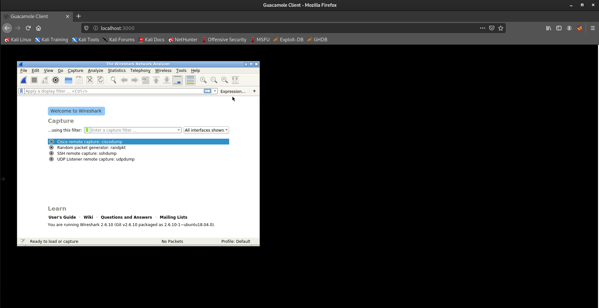
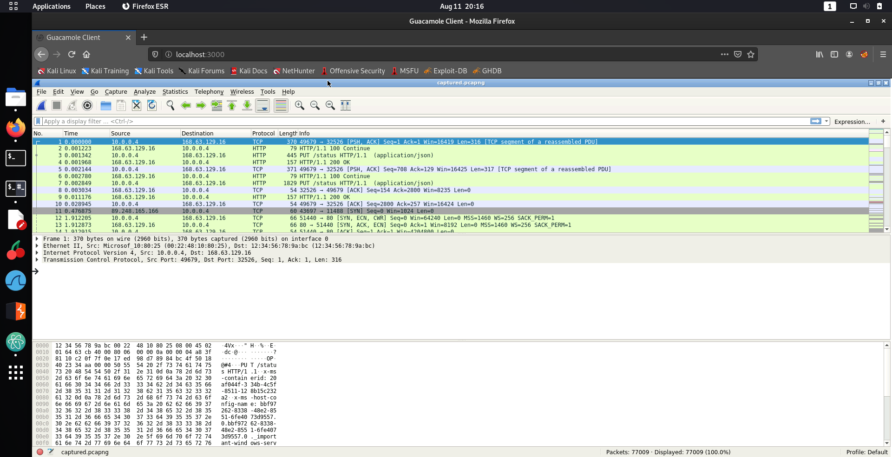

# Wireshark and Docker

Wireshark is a network capture and analysis tool which is really useful in forensics to analyse what the adversary has done on the network.

Although the recommended method of using Wireshark is downloading it from [**here**](https://www.wireshark.org/#download), but can use `docker` instead to run Wireshark. Run the following `docker run` command in your terminal on your host machine to pull the Wireshark image and start it.

```bash
docker run -d \
  --name=wireshark \
  -e PUID=1000 \
  -e PGID=1000 \
  -e TZ=Europe/London \
  -p 3000:3000 \
  -v /path/to/config:/config \
  --restart unless-stopped \
  ghcr.io/linuxserver/wireshark
```

What this container does is start a server at [**http://localhost:3000/**](http://localhost:3000/) that you can visit in your browser to view Wireshark, as shown below.



Next we will need to copy the challenge file `captured.pcapng` into this Docker container so we can open it in Wireshark. In your terminal navigate to the same folder where you have extracted `captured.pcapng` and run the following `docker cp` command, which will copy the `captured.pcapng` to `/captured.pcapng` on the Wireshark container.

```bash
docker cp ./captured.pcapng wireshark:/captured.pcapng
```

Now you can open the `captured.pcapng` file clicking the **File** then **Open** from inside of Wireshark. Navigate to the `/` folder and open `captured.pcapng` and if you did it correctly you'll see something similar to the below screenshot.



# Basic Wireshark Filters

This packet dump captured **a lot of packets**, so you'll need to use Display Filters to filter the traffic that you see. You write your display filters in the input section that says **"Apply a display filter ... <Ctrl-/>"** near the top part of the wireshark window.

For an example, if you only want to see the traffic to and from the IP address `168.63.129.16` you can use the filter `ip.addr == 168.63.129.16`. If you only want to look to traffic using the TCP transport protocol going to port 80 you can use the filter `tcp.dstport == 80`. You can also specify application layer protocols to view the traffic for a specific application. For an example, if you want to view the web traffic you can use the `http` filter that only displays the HTTP traffic (the application layer protocol for websites).

If you want to learn more about display filters in Wireshark you can check out [this cheat sheet](https://cdn.comparitech.com/wp-content/uploads/2019/06/Wireshark-Cheat-Sheet-1.jpg). However, for these challenges we help you out by saying which filters to use.

Here are also some resources that you can use to learn how to use Wireshark, but these challenges will be fairly guided for this assignment.

* Youtube Video by Anson Alexander: https://www.youtube.com/watch?v=TkCSr30UojM
* Display Filters to Limit Output: https://wiki.wireshark.org/DisplayFilters
